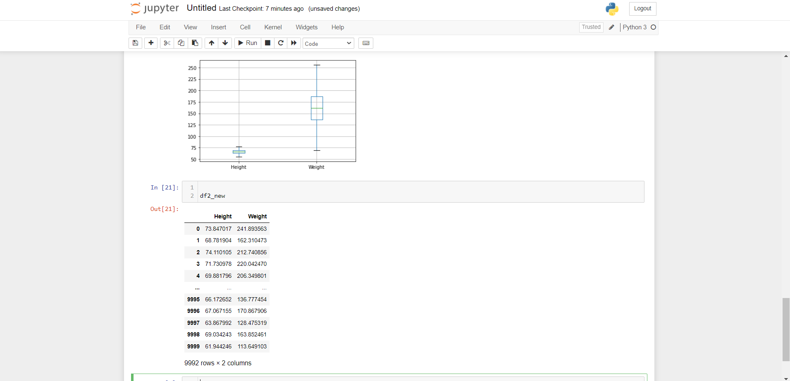
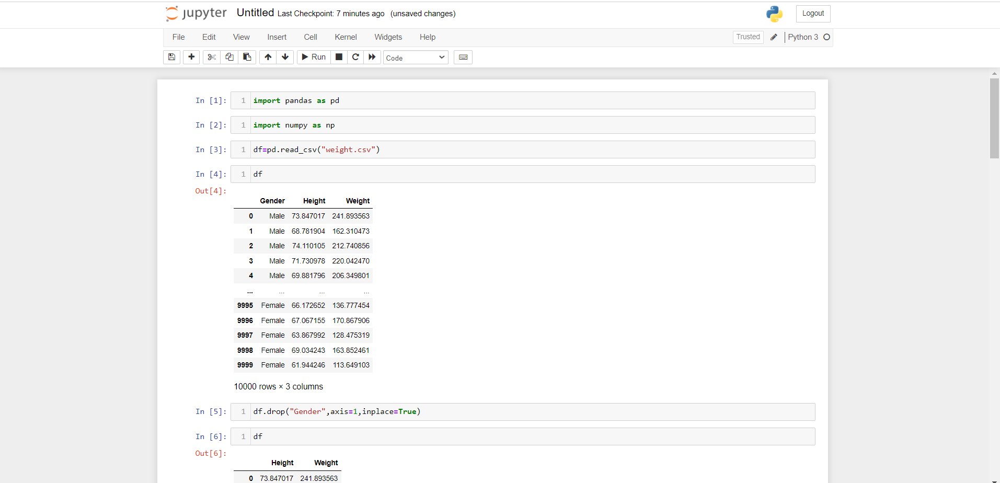
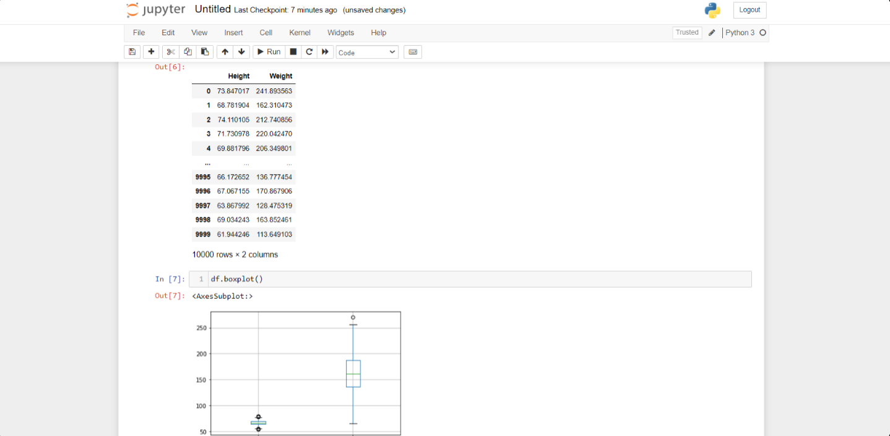
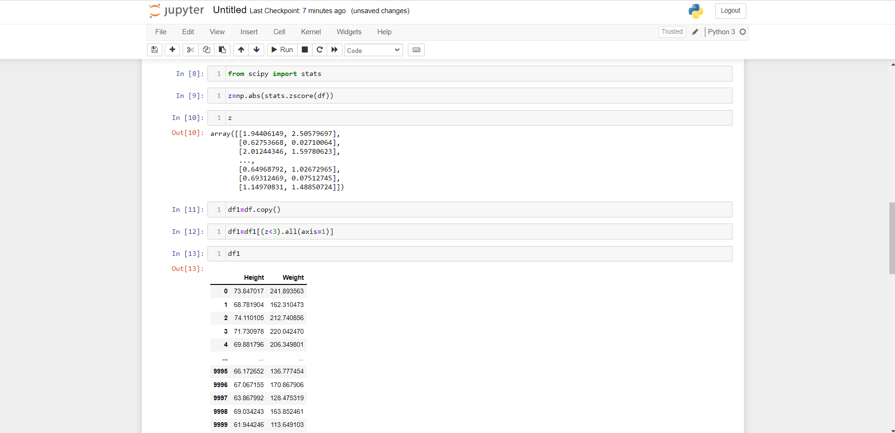

<<<<<<< HEAD
 # EXPERIMENT 2 :

# AIM:
To Detect and Remove Outliers from the given Dataset.

# EXPLAINATION:
Outlier is a data object that deviates significantly from the rest of the data objects and behaves in a different manner. They can be caused by measurement or execution errors. The analysis of outlier data is referred to as outlier analysis or outlier mining. The box plot is a useful graphical display for describing the behavior of the data in the middle as well as at the ends of the distributions. The box plot uses the median and the lower and upper quartiles (defined as the 25th and 75th percentiles). If the lower quartile is Q1 and the upper quartile is Q3, then the difference (Q3 - Q1) is called the interquartile range or IQ.

# ALGORITHM:
Step 1:-
Import the required packages.

Step 2:-
Read the csv file and convert them into Dataframe.

Step 3:-
Use drop function to remove a column "Gender" from the Dataframe.

Step 4:-
Apply Graphical Method "Box plot",which exhibits the Outliers.

Step 5:-
Apply Z-score function defined in scipy library to detect the outliers.

Step 6:-
Apply Statistical Method "Interquartile Range(IQR)" ,to remove the Outliers from the Dataset.

# CODE:
~~~
import pandas as pd
import numpy as np
df=pd.read_csv("weight.csv")
df
df.drop("Gender",axis=1,inplace=True)
df
df.boxplot()
from scipy import stats
z=np.abs(stats.zscore(df))
z
df1=df.copy()
df1=df1[(z<3).all(axis=1)]
df1
df1.boxplot()
df2=df.copy()
q1=df2.quantile(0.25)
q3=df2.quantile(0.75)
IQR=q3-q1
df2_new=df2[((df2>=q1-1.5*IQR)&(df2<=q3+1.5*IQR)).all(axis=1)]
df2_new.boxplot()
df2_new
~~~
# OUTPUT :

# RESULT :

Thus the outliers are detected and removed from the dataset .

